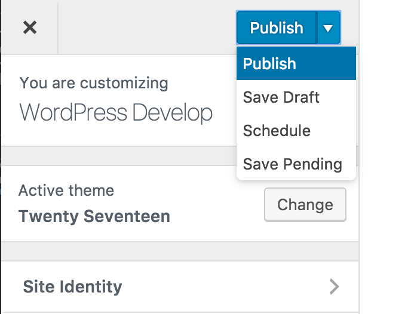
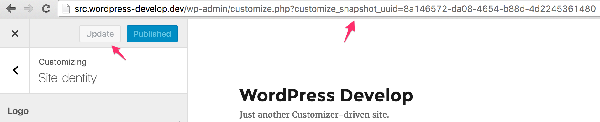
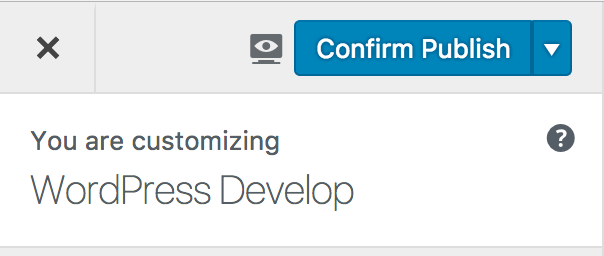
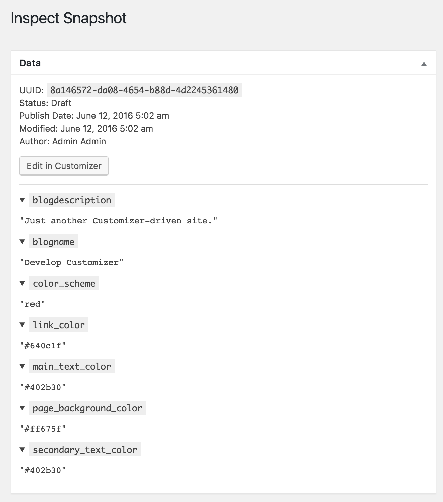
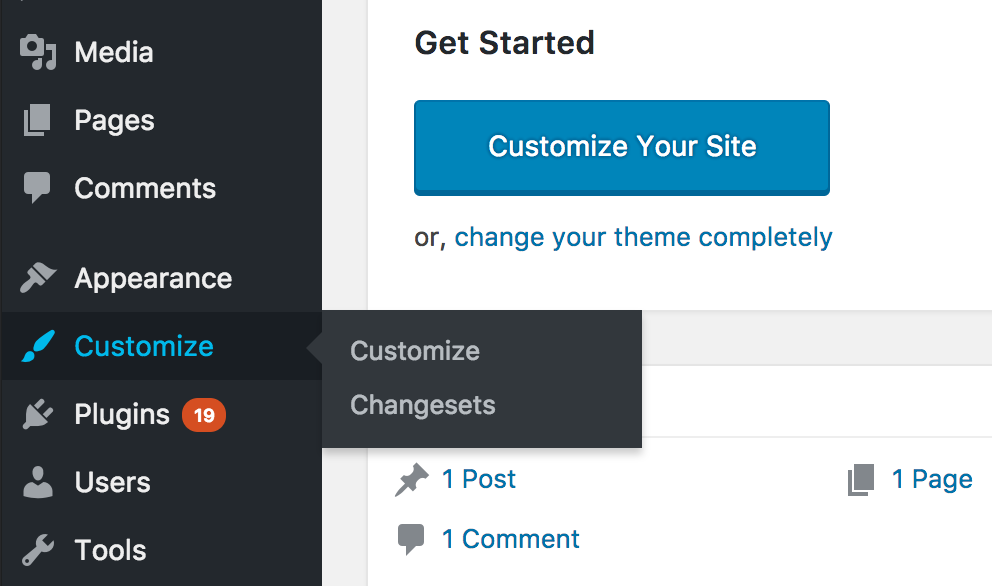
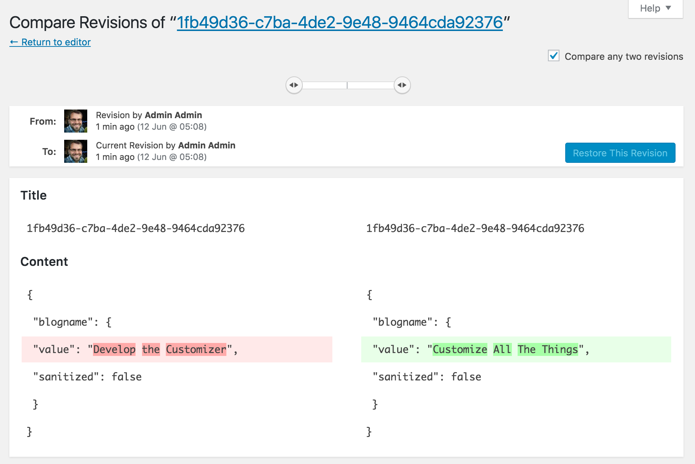

<!-- DO NOT EDIT THIS FILE; it is auto-generated from readme.txt -->
# Customize Snapshots

Allow Customizer states to be drafted, and previewed with a private URL.

**Contributors:** [westonruter](https://profiles.wordpress.org/westonruter), [valendesigns](https://profiles.wordpress.org/valendesigns), [xwp](https://profiles.wordpress.org/xwp), [newscorpau](https://profiles.wordpress.org/newscorpau)  
**Tags:** [customizer](https://wordpress.org/plugins/tags/customizer), [customize](https://wordpress.org/plugins/tags/customize), [snapshots](https://wordpress.org/plugins/tags/snapshots)  
**Requires at least:** 4.6-beta2  
**Tested up to:** trunk  
**Stable tag:** 0.4.0  
**License:** [GPLv2 or later](http://www.gnu.org/licenses/gpl-2.0.html)  

    

## Description ##

Customize Snapshots save the state of a Customizer session so it can be shared or even publish at a future date. A snapshot can be shared with a private URL to both authenticated and non authenticated users. This means anyone can preview a snapshot's settings on the front-end without loading the Customizer, and authenticated users can load the snapshot into the Customizer and publish or amend the settings at any time.

Requires PHP 5.3+.

**Development of this plugin is done [on GitHub](https://github.com/xwp/wp-customize-snapshots). Pull requests welcome. Please see [issues](https://github.com/xwp/wp-customize-snapshots) reported there before going to the [plugin forum](https://wordpress.org/support/plugin/customize-snapshots).**

## Screenshots ##

### The “Save & Publish” button is broken up into separate “Save” and “Publish” buttons. The “Save” button creates a snapshot and turns into “Update” to save a new snapshot.

### For non-administrator users (who lack the new `customize_publish` capability) the “Publish” button is replaced with a “Submit” button. This takes the snapshot and puts it into a pending status.

### Saving snapshot causes the snapshot UUID to appear in the URL, allowing it to be bookmarked to easily come back to later. Upon publishing, the UUID will be removed from the URL so a new snapshot can be started made.

### The Snapshots admin page lists out all of the snapshots in the system. When the excerpt view is turned on, a list of the settings modified in the snapshot can be seen.

### Viewing a snapshot post in the admin shows all of the modified settings contained within it. A link is provided to open the snapshot in the Customizer to continue making changes.

### Published snapshots are shown in the admin screen but lack the ability to open in the Customizer, as they are intended to be frozen revisions for when the Customizer was saved.

### Changes to snapshots are captured in revisions.

## Changelog ##

### 0.4.0 - 2016-06-11 ###
Added:

* Improved UX by removing save/update dialogs, changing the Snapshot button text to “Save” &amp; “Update” for a more streamlined experience by removing the “full” snapshot option. (Issues <a href="https://github.com/xwp/wp-customize-snapshots/issues/13" class="issue-link js-issue-link" data-url="https://github.com/xwp/wp-customize-snapshots/issues/13" data-id="149683843" data-error-text="Failed to load issue title" data-permission-text="Issue title is private">#13</a>, <a href="https://github.com/xwp/wp-customize-snapshots/issues/42" class="issue-link js-issue-link" data-url="https://github.com/xwp/wp-customize-snapshots/issues/42" data-id="159523365" data-error-text="Failed to load issue title" data-permission-text="Issue title is private">#42</a>, PR <a href="https://github.com/xwp/wp-customize-snapshots/pull/30" class="issue-link js-issue-link" data-url="https://github.com/xwp/wp-customize-snapshots/issues/30" data-id="158083735" data-error-text="Failed to load issue title" data-permission-text="Issue title is private">#30</a>)
* Snapshot UUID is dynamically added to the Customizer URL when a snapshot is first saved and it is stripped from the URL once the settings are published (and the snapshot is published), at which point the snapshot is “frozen”. (Issue <a href="https://github.com/xwp/wp-customize-snapshots/issues/37" class="issue-link js-issue-link" data-url="https://github.com/xwp/wp-customize-snapshots/issues/37" data-id="159311075" data-error-text="Failed to load issue title" data-permission-text="Issue title is private">#37</a>, PR <a href="https://github.com/xwp/wp-customize-snapshots/pull/40" class="issue-link js-issue-link" data-url="https://github.com/xwp/wp-customize-snapshots/issues/40" data-id="159362784" data-error-text="Failed to load issue title" data-permission-text="Issue title is private">#40</a>).
* Update button can now be shift-clicked to open the snapshot on the frontend in a new window.
* Eliminate the storage of non-dirty settings in a Snapshot, which deprecates the <code>scope</code> feature (Issue <a href="https://github.com/xwp/wp-customize-snapshots/issues/42" class="issue-link js-issue-link" data-url="https://github.com/xwp/wp-customize-snapshots/issues/42" data-id="159523365" data-error-text="Failed to load issue title" data-permission-text="Issue title is private">#42</a>)
* Support listing snapshots in the admin and inspecting their contents WP Admin UI, with shortcuts to open snapshot in Customizer, viewing the list of settings contained in a snapshot from the excerpt in post list view (Issue <a href="https://github.com/xwp/wp-customize-snapshots/issues/45" class="issue-link js-issue-link" data-url="https://github.com/xwp/wp-customize-snapshots/issues/45" data-id="159762724" data-error-text="Failed to load issue title" data-permission-text="Issue title is private">#45</a>, PRs <a href="https://github.com/xwp/wp-customize-snapshots/pull/38" class="issue-link js-issue-link" data-url="https://github.com/xwp/wp-customize-snapshots/issues/38" data-id="159336615" data-error-text="Failed to load issue title" data-permission-text="Issue title is private">#38</a>, <a href="https://github.com/xwp/wp-customize-snapshots/pull/46" class="issue-link js-issue-link" data-url="https://github.com/xwp/wp-customize-snapshots/issues/46" data-id="159796414" data-error-text="Failed to load issue title" data-permission-text="Issue title is private">#46</a>).
* Introduce pending snapshots for users who are not administrators (who lack the <code>customize_publish</code> capability) to be able to make snapshots and save them, and then submit them for review once ready (PR <a href="https://github.com/xwp/wp-customize-snapshots/pull/38" class="issue-link js-issue-link" data-url="https://github.com/xwp/wp-customize-snapshots/issues/38" data-id="159336615" data-error-text="Failed to load issue title" data-permission-text="Issue title is private">#38</a>).
* Added revisions for snapshots so that changes to a snapshot made before the time it is published can be tracked.
* New banner image and icon (Issue <a href="https://github.com/xwp/wp-customize-snapshots/issues/24" class="issue-link js-issue-link" data-url="https://github.com/xwp/wp-customize-snapshots/issues/24" data-id="151752405" data-error-text="Failed to load issue title" data-permission-text="Issue title is private">#24</a>, PR <a href="https://github.com/xwp/wp-customize-snapshots/pull/27" class="issue-link js-issue-link" data-url="https://github.com/xwp/wp-customize-snapshots/issues/27" data-id="151762646" data-error-text="Failed to load issue title" data-permission-text="Issue title is private">#27</a>).
* Bumped minimum WordPress version to 4.5.

Fixed:

* Store content in `post_content` instead of `post_content_filtered` (Issue <a href="https://github.com/xwp/wp-customize-snapshots/issues/25" class="issue-link js-issue-link" data-url="https://github.com/xwp/wp-customize-snapshots/issues/25" data-id="151753100" data-error-text="Failed to load issue title" data-permission-text="Issue title is private">#25</a>, PRs <a href="https://github.com/xwp/wp-customize-snapshots/pull/36" class="issue-link js-issue-link" data-url="https://github.com/xwp/wp-customize-snapshots/issues/36" data-id="159058487" data-error-text="Failed to load issue title" data-permission-text="Issue title is private">#36</a>, <a href="https://github.com/xwp/wp-customize-snapshots/pull/43" class="issue-link js-issue-link" data-url="https://github.com/xwp/wp-customize-snapshots/issues/43" data-id="159702836" data-error-text="Failed to load issue title" data-permission-text="Issue title is private">#43</a>). <em>This breaks backwards compatibility with existing snapshots.</em>
* Replace <code>customize-snapshots</code> JS dependency from <code>customize-widgets</code> to <code>customize-controls</code> (PR <a href="https://github.com/xwp/wp-customize-snapshots/pull/14" class="issue-link js-issue-link" data-url="https://github.com/xwp/wp-customize-snapshots/issues/14" data-id="150516750" data-error-text="Failed to load issue title" data-permission-text="Issue title is private">#14</a>).
* Ensure that widget actions and filters are added when previewing snapshots from the front-end (Issue <a href="https://github.com/xwp/wp-customize-snapshots/pull/34" class="issue-link js-issue-link" data-url="https://github.com/xwp/wp-customize-snapshots/issues/34" data-id="158843216" data-error-text="Failed to load issue title" data-permission-text="Issue title is private">#34</a>, PR <a href="https://github.com/xwp/wp-customize-snapshots/issues/33" class="issue-link js-issue-link" data-id="158772746" data-error-text="Failed to load issue title" data-permission-text="Issue title is private" title="Ensure that widget actions and filters get added for previewing snapshots for unauthenticated users">#33</a>).
* Use <code>wp_slash()</code> instead of <code>add_magic_quotes()</code> when loading the snapshot post vars (PR <a href="https://github.com/xwp/wp-customize-snapshots/pull/23" class="issue-link js-issue-link" data-url="https://github.com/xwp/wp-customize-snapshots/issues/23" data-id="151289131" data-error-text="Failed to load issue title" data-permission-text="Issue title is private">#23</a>).
* Update <code>dev-lib</code>.

See full commit log: <a href="https://github.com/xwp/wp-customize-snapshots/compare/0.3.1...0.4.0" class="commit-link"><code>0.3.1...0.4.0</code></a> 
Issues/PRs in release: <a href="https://github.com/xwp/wp-customize-snapshots/issues?q=milestone%3A0.4.0"><code>milestone:0.4.0</code></a> 
Props: Weston Ruter (<a href="https://github.com/westonruter" class="user-mention">@westonruter</a>), Derek Herman (<a href="https://github.com/valendesigns" class="user-mention">@valendesigns</a>), Luke Carbis (<a href="https://github.com/lukecarbis" class="user-mention">@lukecarbis</a>)

### 0.3.1 ###
* Fix additional WordPress VIP issues.
* Update `dev-lib`.
* Update Coveralls.

### 0.3.0 ###
* Initialize Snapshots before Widget Posts so that `$wp_customize` will be set on the front-end.
* Fix WordPress VIP PHPCS issues.
* Update `dev-lib`.
* Remove unused button markup in dialog.

### 0.2.1 ###
* Fix AYS confirmation if the snapshot state is saved.
* Register dynamic settings to ensure that snapshot settings are recognized in the post values.
* Slash input for `wp_insert_post()` to prevent loss of slashes.

### 0.2 ###
* Added the `customize_publish` capability.
* Separate "Save" & "Publish" buttons.

### 0.1.1 ###
* Fix widget preview.

### 0.1 ###
* Initial release.

